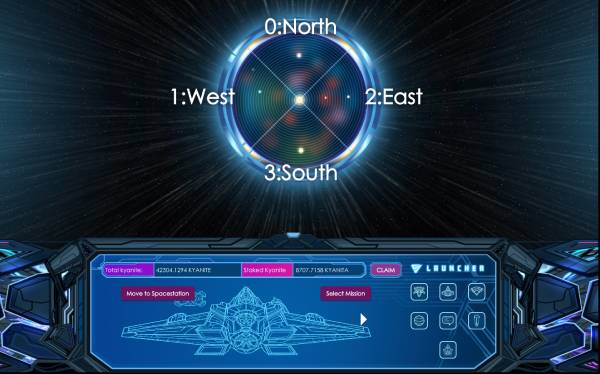
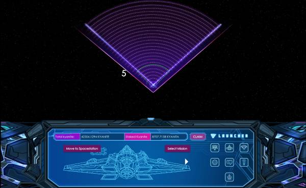
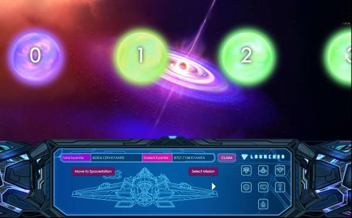
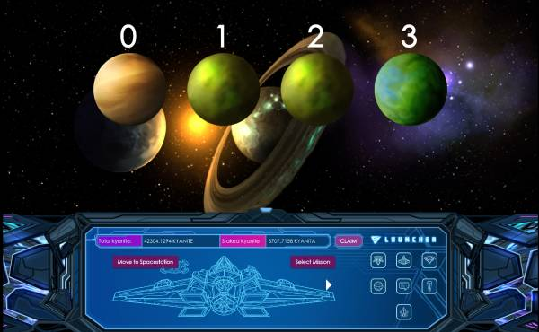

# Deploy Starship - Stylebot styles

The CSS styles in ```stylebot.css``` are intended to add some quality of life improvements to the Starship browser game
whilst it is still in it's rough-and-ready alpha stage.

You must use the Chrome extension [Stylebot](https://chrome.google.com/webstore/detail/stylebot/oiaejidbmkiecgbjeifoejpgmdaleoha?hl=en-GB) 
to apply the styles, whilst on the Starship game site.

## Features

- Added CSS-only tooltips to nav menu
- Made the in-game chat more usable by making it much bigger
- Added a background to the modals - stake kyanite and error messages, so it’s not just broken looking text floating on the screen
- Added a scrollbar to the screen where you choose your starship components so you can actually scroll them all easily by dragging the scrollbar.
- Made the countdown timer number always show in white, so you can actually see it (I’ve also made a TamperMonkey script to show this in hours/mins/seconds too, cause it’s easier on the brain than seeing it in seconds all the time)
- On the radar quadrant selector, I've added some text so you can easily see what number each quad corresponds to eg 0:North, 1:West, 2:East & 3:South
- On the radar/launcher screen where you try to click the parsecs from the space station - I’ve outlined the zone the game is using when you hover over the radar and displayed the section number, so you can more easily and accurately choose the zone you want!!!!!! -  you’ll see from the video, that the actual click zones don’t line up with the graphics, so it’s a bit pot-luck without this fix.
- On the screen after the radar, where you choose 1/24 solar systems, I’ve just added the system number to each one so you can more easily pick the one you want without having to count them!!!!!

---
### Installation 

After you have added the Stylebot extension, follow these instructions...

1) Make sure you're on the starship game website.
2) Pin the Stylebot extention, if you don't see the icon in Chrome's extension icons toolbar.
3) Click the stylebot icon and then Open Stylebot.
4) Open the editor tab.
5) Paste in my CSS from the `stylebot.css` file.

---

### Feature screenshots




